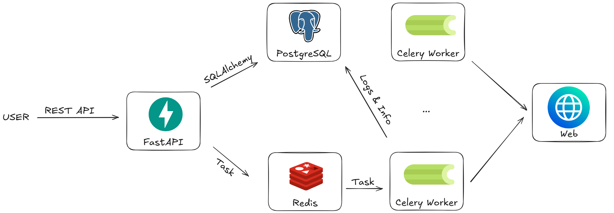

## What is this?
This is a service that could be hosted on Raspberry Pi and monitors changes on websites notifying the user (through Telegram, email, Discord etc.) about changes on them. An LLM would make a consise report at the end, while the rest of the script will make sure that no tokens are wasted filtering content and comparing what's possible itself.

The project is currently in development.

## How does it work:
Stack:
- FastAPI, Uvicorn, Pydantic
- PostgreSQL, SQLAlchemy, Alembic,
- Redis, Celery,
- Docker, Docker Compose
- C++, pybind11

## C++ Fast Diff Module
Initially I wanted to move the comparison logic of filtered HTML content (just raw HTML body) to C++, but a few ideas led me to considering new appoaches:

- Normalized (same as raw HTML body but all the tags removed: `<head>`, `<script>`, `<style>`, `<noscript>` etc.)
    - Fast
    - Questionable precision, false-positives are possible. This change will not trigger it:
        - `<button>Buy</button>`
        - `<button disabled>Buy</button>`

- Compare DOM Trees using AST and algorithms like Zhang-Shasha algorithm or GumTree.
    - Max presision, no false-positives.
    - Nice benefits: layout invariance, ability to track state & metadata, subtree scoping
    - Bad performance (O(n^3) for Zhang-Shasha and O(n^2) for GumTree), euristic approximations are still slow and not accurate enough.
    - Not easy to implement, questionable ROI

- So what is possible? We know that string comporison is fast, so we can make the tree flat, like this: `div.card > span.price: 500 zł`. This is kind of a middle ground. The only downside is that it is not layout invariant, but it does not matter that much.

## Problems to be solved:
- A lot of websites today are dynamically rendered with JS which forces the use of tools like Playwright, which is resource-intensive and goes against the idea of being fast, lightweight & running this on a Raspberry Pi.
- 70% of the internet is behind Cloudflare which makes them almost unreachable for the script
    - Can be solved by reusing cookies from local browser?
    - Captcha Solvers
    - Human-in-the-Loop
    - Proactive Evasion (Rate Limiting & Jitter, clear IP, User-Agent etc.)
    - Alternatives:
        - Webhooks
        - Public/private GraphQL or REST APIs

## Next steps:
- Containerization and Multi-stage Docker build
- Improve DB scheme (PostgreSQL + Alembic)
    - add `last_signatures` (JSONB)
    - add `last_hash`
- Celery pipeline refactor
    - DONE Fetch
    - Extract
    - Quick Hash Check
    - Diff (load old signatures from db and calling C++ module)
    - State Update (update signatures, hash, timestamp in db)
    - Save logs
- Anomaly filter (if 100% was added and 100% removed, it is probably a false positive)
- Volume limit (send only relevant info if too much changes)
- Add LLM report generation (Google API)
- Telegram bot integration (either Go or Python)
- Benchmarks and performance tests

## Existing solutions:
- Huginn, n8n, changedetection.io, Distill Web Monitor (paid extension)
